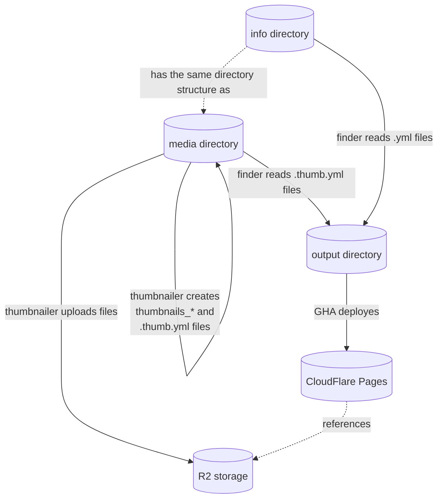

# thumbnailer

## Overview

An app that walks through a directory and creates sprite thumbnails for every directory with images in it.
It also creates a `.thumbs.yml` in the directory with the image paths and their dimensions,
that can be used by other apps to display the thumbnails.

## Techincal overview

The app is written in Go and uses the following libraries:

* [github.com/nfnt/resize](https://github.com/nfnt/resize) to resize the images
* [github.com/aws/aws-sdk-go-v2](https://github.com/aws/aws-sdk-go-v2) to upload images to CloudFlare R2 storage
* [github.com/bbrks/go-blurhash](https://github.com/bbrks/go-blurhash) to generate Blurhashes for the thumbnails

If directory contains files with different extensions (`.jpg` and `.png`), then different thumbnails are created for each extension. `.jpeg` and `jpg` are treated as the same extension.

A signle `thumbnails_*` file may contain up to 500 images. If there are more images in the directory, then multiple `thumbnails_*` files are created.

Related repositories:

* [media](https://github.com/alsosee/media) - all images, thumbnails and .thumbs.yml files
* [finder](https://github.com/alsosee/finder) - a static site generator
* [info](https://github.com/alsosee/info) - all YML files describing different things



## Usage

### Local

```bash
export INPUT_MEDIA=/Users/username/Projects/alsosee/media
export INPUT_R2_ACCOUNT_ID=...
export INPUT_R2_ACCESS_KEY_ID=...
export INPUT_R2_ACCESS_KEY_SECRET=...
export INPUT_R2_BUCKET=media

make run
```
